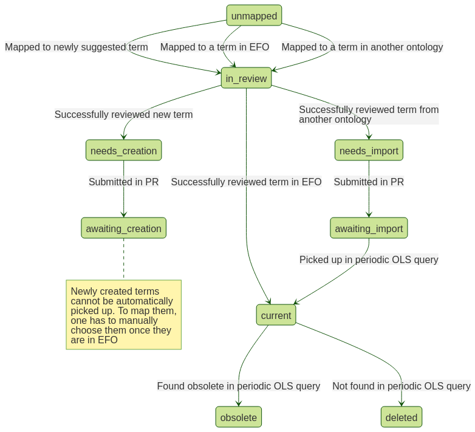

# Data model description and trait status explanation

- `traits` (id, trait_name, current_mapping[foreign_key], status[computed_key], number_of_source_records, timestamp_added, timestamp_updated)
  + The master status is meant to reflect the state of the mapping and provide insight as to what should be the next action. It can contain all the possible trait statuses, as well as `unmapped` and in `in_review` statuses. It is never changed explicitly and is always computed based on:
(1) the `is_reviewed` status of the current_mapping and on (2) the status of the ontology term the current_mapping is pointing to.
- `users` (id, name, email, role[enum])
- `mappings` (id, trait_id [foreign_key], ontology_term[foreign_key], curator [foreign_key], is_reviewed[computed_boolean], timestamp_mapped)
  + The `is_reviewed` field status is computed based on the reviews table.
Important consideration to note is that mappings are not unique in regard to (trait_id, ontology_term) pair. It is possible that a mapping from a certain trait to a certain ontology term is proposed multiple times in the history of the trait. These are stored in the database as separate entities for historical purposes, and displayed in the trait history.
- `ontology_terms`:(id, curie, uri, label, status, description, cross_refs)
  + The `uri` field represents the complete URI, e. g. http://www.ebi.ac.uk/efo/EFO_0000249, while `term` stores the corresponding CURIE (compact URI), in this case EFO:0000249. Note that while URL uses an underscore, CURIE uses a colon to separate namespace and an identifier. Both the URI and the CURIE can be obtained through the OLS query.
  + A note to make, is that the `description` and `cross_refs` fields only apply to new term suggestions created via our web app. Other terms will have those fields empty.
  + The ontology term status can be either `current`, `obsolete`, `deleted`, `needs_import`, `needs_creation`, `awaiting_import`, `awaiting_creation`. This status is automatically computed, except for moving out of the “awaiting_creation” status, which requires a manual check.
- `mapping_suggestions` (id, trait_id [foreign_key], ontology_id [foreign_key], made_by[foreign_key], timestamp)
- `reviews` (id, mapping_id [foreign_key], reviewer [foreign_key])
- `comments` (id, trait_id [foreign_key], author[foreign_key], date, body)
  + Comments apply to a trait in general, not to its specific state or the mappings. Essentially this is just free text displayed inline with the status and mapping changes.

## Trait statuses and their transitions

| Action | Ontology term status | Mapping review status  (computed based  on reviews table) | Trait status - master (computed based on  the previous two) |
| ---------------------------------------------------------------------------------------------------------------------------------------------------------------------------- | -------------------- | --------------------------------------------------------------- | ---------------------------------------------------------------- |
| **Case 1. Curator chooses an existing term from EFO** | current | not_reviewed | awaiting review |
| A necessary number of reviews is accumulated| current | reviewed | current |
|     |       |        |
| **Case 2. Curator chooses an existing term which is _not_ in EFO (needs import)**| needs_import |not_reviewed | awaiting_review |
| A necessary number of reviews is accumulated | needs_import | reviewed | needs import |
| A batch PR is submitted for this and other terms (for import and creation) | awaiting_import | reviewed | awaiting_import |
| A term import is completed — the new ontology term status is caught automatically during a periodic OLS status refresh.  After import the same term will now be "current" | current | reviewed | current |
|      |      |       |       |
| **Case 3. Curator chooses a new term which is not in _any_ ontology (needs creation)** | needs_creation | not_reviewed | awaiting_review |
| A necessary number of reviews is accumulated | needs_creation | reviewed | needs_creation |
| A batch PR is submitted for this and other terms (for import and creation) | awaiting_creation | reviewed | awaiting_creation |
| After the PR is closed and new terms are created, the curator  manually selects a new term | current | not_reviewed | awaiting_review |
| A necessary number of reviews for the newly created term is accumulated | current | reviewed | current |

### Diagram:

